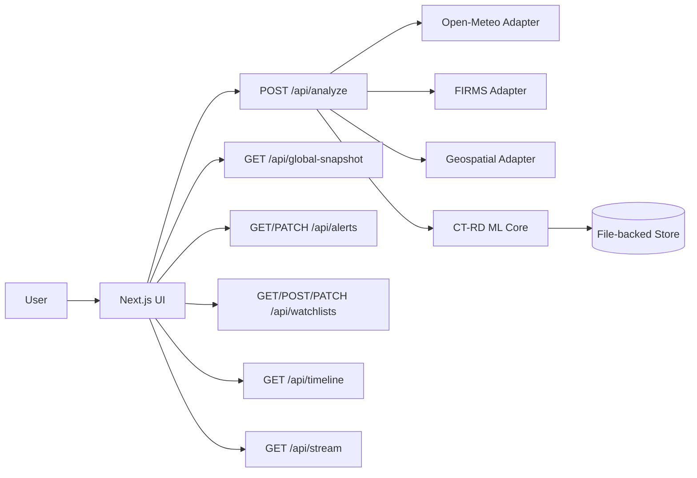

# Architecture v2

## Overview

The v2 platform is a map-first wildfire monitoring system with integrated ML forecasting.

## Data Flow

1. User submits region and data context to `/api/analyze`.
2. API fetches weather, hotspot, and geospatial features.
3. ML core computes multi-horizon risk forecasts, confidence intervals, and explainability signals.
4. Result and alert metadata are persisted for global snapshot and timeline replay.
5. UI consumes snapshot/feed/watchlist/alert endpoints for operational monitoring.

## Runtime Notes

- External services are optional and can degrade gracefully.
- In-memory cache reduces repeated upstream API calls.
- File-backed store supports watchlists, alerts, and replay history for local deployments.

